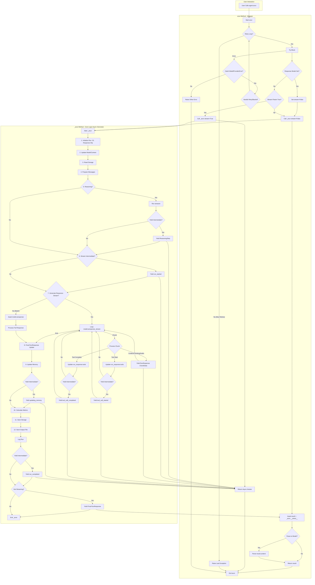

Okay, let's dive into the `arun` and `_arun` methods in `agno/agent/agent.py`.

**Overall Purpose:**

The primary goal of these methods is to execute a "run" of the agent. This involves preparing input, sending it to the underlying AI model, potentially handling tool calls (function calling), processing the model's response (either as a stream or a single batch), updating the agent's internal state (memory), and returning the final result. `arun` acts as the public entry point, handling retries and deciding _how_ to call the core logic in `_arun`. `_arun` performs the actual step-by-step execution and interacts with the model.

**`arun` (The Public Wrapper):**

- **Entry Point:** This is the method users typically call to run the agent asynchronously.
- **Retry Logic:** It implements a retry loop (`for attempt in range(num_attempts)`). If a `ModelProviderError` occurs during the execution of `_arun`, it catches the exception, logs a warning, potentially waits (with exponential backoff), and tries again up to `retries + 1` times. It re-raises `StopAgentRun` exceptions immediately and handles `KeyboardInterrupt` gracefully.
- **Stream Handling:** It determines the final `stream` value based on the input argument and the agent's default setting (`self.stream`).
- **Response Model Handling:**
  - If `self.response_model` is set (meaning the user expects structured output conforming to a specific Pydantic model), `arun` _forces_ `stream=False` when calling `_arun`.
  - After `_arun` returns the complete `RunResponse`, `arun` checks if the content is already in the correct model format. If not (e.g., it's a string), it attempts to parse the string content into the `self.response_model` using `parse_response_model_str`.
  - It returns the final `RunResponse`, potentially with its `.content` attribute parsed into the structured model.
- **Calling `_arun`:** Based on the `stream` flag and whether `response_model` is set:
  - If `stream=True` (and no `response_model`), it calls `_arun` with `stream=True` and returns the `AsyncIterator[RunResponse]` directly. The caller is then responsible for iterating through the yielded responses.
  - If `stream=False` (or `response_model` is set), it calls `_arun` with `stream=False`, awaits the _first_ (and only) result yielded by `_arun` using `.__anext__()`, and returns that single, complete `RunResponse`.

**`_arun` (The Core Implementation - Async Generator):**

This method is an `async def` that returns an `AsyncIterator[RunResponse]`. This means it uses `yield` to produce results. Even when not streaming, it technically yields the final result once at the end.

Here's a breakdown of its steps:

1.  **Prepare Run:**
    - Initializes the agent (`self.initialize_agent`).
    - Sets instance variables for `stream` and `stream_intermediate_steps`.
    - Creates a unique `run_id` and initializes `self.run_response` (an object to hold all data about the current run).
2.  **Update Model & Context:**
    - Ensures the model is configured (`self.update_model`).
    - Resolves any dynamic context if needed (`self.resolve_run_context`).
3.  **Read Storage:** Loads the previous state (e.g., conversation history) from storage into the agent's memory (`self.read_from_storage`).
4.  **Prepare Messages:** Takes the input `message`, `messages`, media (`audio`, `images`, etc.) and combines them with existing memory/context/system prompts into the final list of `RunMessages` (`run_messages`) to be sent to the model.
5.  **Reason (Optional):** If `self.reasoning` is enabled, it calls `self.areason`. If streaming is enabled (`self.stream`), it yields any intermediate reasoning steps produced by `areason`. Otherwise, it consumes the `areason` generator without yielding.
6.  **Start Run Event:** If `self.stream_intermediate_steps` is true, it `yield`s a `RunResponse` with `event=RunEvent.run_started`.
7.  **Generate Response (Crucial Step):** This is where it interacts with the underlying model (`self.model`).
    - **If Streaming (`stream and self.is_streamable`):**
      - Calls `self.model.aresponse_stream(messages=run_messages.messages)`. This returns an async iterator that yields chunks of the model's response.
      - Enters an `async for model_response_chunk in model_response_stream:` loop.
      - Inside the loop, it processes each `model_response_chunk`:
        - **Assistant Response:** If the chunk contains text content, thinking text, citations, or audio data, it appends this data to the accumulating `model_response` object _and_ updates `self.run_response`. It then `yield`s a _new_ `RunResponse` containing _just the data from that specific chunk_ (`model_response_chunk.content`, `.thinking`, `.citations`, `.audio`). This is how `aprint_response` gets live updates.
        - **Tool Call Started:** If the chunk indicates a tool call has started, it adds the tool call information to `self.run_response.tools`. If `stream_intermediate_steps` is true, it `yield`s a `RunResponse` with `event=RunEvent.tool_call_started`.
        - **Tool Call Completed:** If the chunk contains the result of a tool call, it updates the corresponding tool call entry in `self.run_response.tools`. If `stream_intermediate_steps` is true, it `yield`s a `RunResponse` with `event=RunEvent.tool_call_completed`.
    - **If Not Streaming (Batch Mode):**
      - Calls `await self.model.aresponse(messages=run_messages.messages)`. This waits for the _entire_ model response.
      - Processes the complete `model_response` at once, updating `self.run_response` with the final content, thinking, tool calls, audio, etc.
8.  **Update RunResponse (Final):** Adds the final list of messages used in the run and calculated metrics to `self.run_response`.
9.  **Update Agent Memory:**
    - Adds the system prompt, user messages, and the final assistant response (including tool calls) to the agent's memory (`self.memory.add_messages`, `self.memory.add_run`).
    - Potentially updates user-specific memories or session summaries (`self.memory.aupdate_memory`, `self.memory.aupdate_summary`).
    - If `stream_intermediate_steps` is true, `yield`s a `RunResponse` with `event=RunEvent.updating_memory`.
10. **Calculate Session Metrics:** Computes overall metrics for the session.
11. **Save Session:** Writes the updated agent memory/state back to storage (`self.write_to_storage`).
12. **Save Output File:** Saves the `self.run_response` object to a file if configured.
13. **Log Run:** Logs details about the completed run.
14. **Final Yield:**
    - If `stream_intermediate_steps` is true, `yield`s a `RunResponse` with `event=RunEvent.run_completed`.
    - **Important:** If the method was called in _non-streaming_ mode (`self.stream` is false), it `yield`s the final, complete `self.run_response` object _here_. This is the single result that `arun` awaits using `.__anext__()` in batch mode.

**Mermaid Diagram:**

This diagram shows the flow control within `arun`, including the retry loop and the branching based on `response_model` and `stream`. It then depicts the main steps within `_arun`, highlighting the crucial difference between the streaming path (looping through `aresponse_stream` and yielding chunks) and the batch path (awaiting `aresponse` and yielding once at the end if not streaming).
